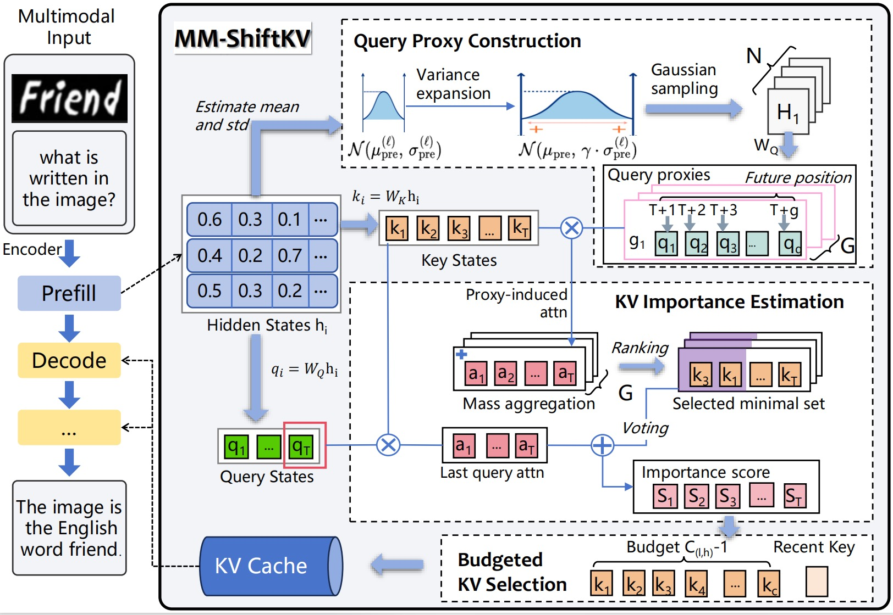

# MM-ShiftKV: Decode-Aware Prefill-Stage KV Selection for MLLMs

This repository contains the official PyTorch implementation of **MM-ShiftKV**,
a training-free and strictly prefill-only Key–Value (KV) cache selection method
for efficient inference in multimodal large language models (MLLMs).

MM-ShiftKV explicitly addresses the systematic **prefill–decode scale mismatch**
in multimodal inference and provides a decode-aware KV selection strategy
without any decoding-time intervention.

---

## Introduction

Key–Value (KV) caching is essential for efficient autoregressive inference in
large language models. In multimodal settings, however, the KV cache size grows
rapidly due to the large number of visual tokens, becoming a major bottleneck
for both memory usage and decoding latency.

Existing **prefill-only** KV selection methods estimate KV importance from
prefilling-stage statistics, implicitly assuming that prefilling-time queries
are representative of decoding-time behavior.
MM-ShiftKV shows that this assumption breaks down in multimodal inference and
proposes a **decode-aware but strictly prefill-only** KV selection framework.

<p align="center" width="100%">
  
</p>

---

## Key Features

- Decode-aware KV selection at the prefill stage
- Training-free and plug-and-play
- No decoding-time eviction or re-ranking
- Compatible with FlashAttention, GQA, and MQA
- Robust under extreme KV cache compression
- Supports Qwen2.5-VL and LLaVA-1.6

---

## Main Results

### Results on Multimodal Benchmarks
<p align="center" width="100%">
  
</p>

### Decoding Efficiency
<p align="center" width="100%">
  
</p>

---

## Getting Started

### Clone the Repository
```bash
git clone https://github.com/anonymous/MM-ShiftKV.git
cd MM-ShiftKV
````

### Create Environment

```bash
conda create -n mmshiftkv python=3.10 -y
conda activate mmshiftkv
```

### HuggingFace Mirror (Recommended for China Mainland)

```bash
export HF_ENDPOINT=https://hf-mirror.com
```

---

## Installation

### Step 1: Install PyTorch (Required First)

All CUDA extensions must be compiled **after PyTorch**.

```bash
pip install packaging
pip install torch==2.5.1
```

---

### Step 2: Compile CUDA Extensions

```bash
cd csrc
make
cd ..
```

If compilation fails, please verify:

* GPU compute capability
* CUDA version
* Compile flags in `csrc/build.py`

---

### Step 3: Install MM-ShiftKV

```bash
pip install -e .
```

---

### Step 4: Install FlashAttention

FlashAttention is required for efficient decoding.

```bash
pip download --no-deps flash-attn==2.4.1 -d ~/flashattn_cache
pip install flash-attn==2.4.1 --no-build-isolation
```

Currently, only FlashAttention-based decoding is supported.

---

### Step 5: Additional Dependencies

```bash
pip install qwen-vl-utils
```

---

## Evaluation

We use **lmms-eval** for standardized multimodal evaluation.

```bash
cd lmms-eval
pip install -e .
cd ..
```

---

## Usage

### Inference

```bash
bash scripts/infer/qwen.sh
bash scripts/infer/llava.sh
```

### Evaluation

```bash
bash scripts/eval/qwen.sh
bash scripts/eval/llava.sh
```

### Visualization

```bash
bash scripts/others/viz.sh
```

### Speed and Memory Profiling

```bash
bash scripts/others/speed_and_memory.sh
```

---

## Repository Structure

```text
MM-ShiftKV/
├── assets/        # Figures and visualizations
├── csrc/          # CUDA extensions
├── mmshiftkv/     # Core implementation
├── scripts/       # Inference / evaluation scripts
├── lmms-eval/     # Evaluation framework
└── README.md
```

---

## Notes

* CUDA extensions must be compiled after PyTorch installation
* FlashAttention requires compatible PyTorch and CUDA versions
* Use HuggingFace mirror if model download is slow

---

## Citation

```bibtex
@article{mmshiftkv2026,
  title={MM-ShiftKV: Decode-Aware Prefill-Stage KV Selection for Multimodal Large Language Models},
  author={Anonymous},
  journal={arXiv preprint},
  year={2026}
}
```

---

## Acknowledgements

This codebase is inspired by and complementary to prior KV-cache optimization
methods, including SnapKV, PyramidKV, AdaKV, and SparseMM.
We thank the lmms-eval team for providing a robust multimodal evaluation framework.

```

